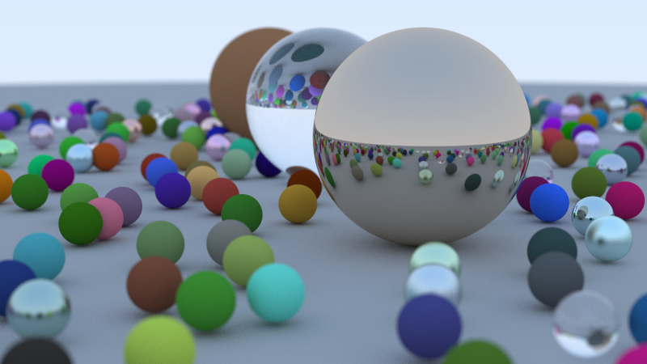

This is my Rust implementation of Peter Shirley's 
[Raytracing in One Weekend](https://github.com/RayTracing/raytracing.github.io) tutorial/book.

Usage: `cargo run -r -- [number of threads] > [file name].ppm`

Example: `cargo run -r -- 4 > cool_scene.ppm`

Final scene:

