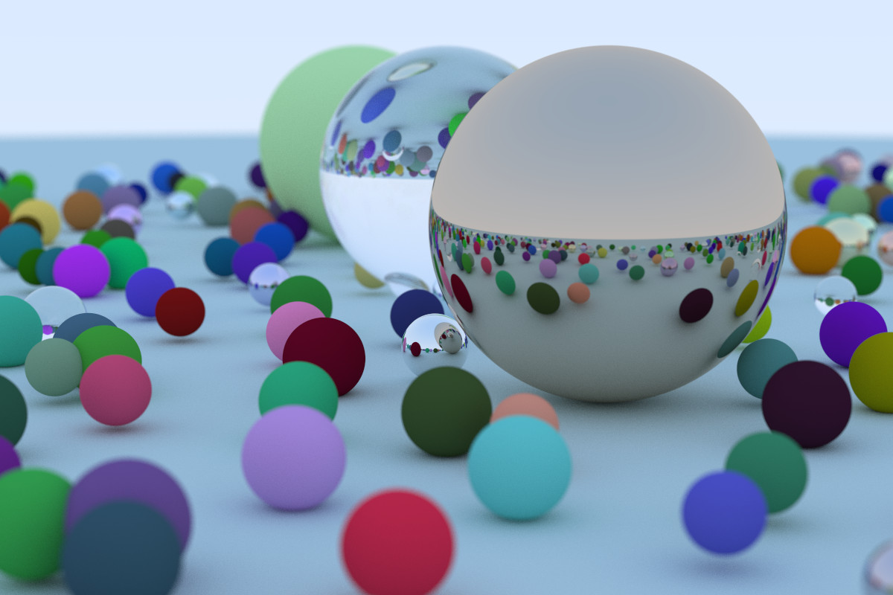

This is my multithreaded 🚀blazingly fast🚀 (not really) Rust implementation of Peter Shirley's 
[Raytracing in One Weekend](https://raytracing.github.io/books/RayTracingInOneWeekend.html#metal) tutorial/book.

Use with `cargo run -r > image.ppm`

Edit `config.toml` to configure settings for output and rendering.

Here is an example image that I rendered in only 1h40m 🔥 

# Configuration

`default_scene.json` defines the 3D scene to render, i.e. the objects in the scene as well as the camera. It can be customized to build custom scenes.

The file must have the following structure. See `default_scene.json` and the [JSON file format](https://www.json.org/json-de.html) for reference.

- `camera` (object)
    - `look_from` (object) The camera's position
        - `x` (number)
        - `y` (number)
        - `z` (number)
    - `look_at` (object) Where the camera is looking at
        - `x` (number)
        - `y` (number)
        - `z` (number)
    - `view_up_direction` (object) A vector describing what direction is considered "up" for the camera
        - `x` (number)
        - `y` (number)
        - `z` (number)
    - `vertical_fov_degrees` (number) The camera's vertical field of view
    - `aperture` (number) How much light reaches the camera. See [wikipedia article](https://en.wikipedia.org/wiki/Aperture) for more information.
    - `focus_distance` (number or null) The distance from the camera to the plane where everything is in focus. If set to null, then everything is in focus.
    - `focal_length` (number) See [wikipedia article](https://en.wikipedia.org/wiki/Focal_length) for more information.

- `materials` (array) [optional] This array can contain any amount of material definitions that can be referred to by name when defining objects.
    - unnamed (object)
        - `name` (string): This is what is used to refer to the material
        - `type` (string): Possible values: `diffuse`, `metal`, `dialectric` (like glass)
        - `color` (object) Is only needed for materials of type `diffuse` or `metal`
            - `rgb` (array of numbers) An array with three numbers for the red, green, and blue parts of the color. They can either all be number from 0 to 1 or from 0 to 255.
            - `normalized` (boolean) Whether `rgb`'s numbers are between 0 and 1 (true) or between 0 and 255 (false).
        - `fuzziness` (number) Is only required for materials of type `metal`
        - `refractive_index` (number) Is only required for materials of type `dialectric`
    - ...

- `objects` (array) All the objects existing in the world/scene
    - (object)
        - `name` (string) [optional] Does not have any effect. Just for documentation.
        - `coordinates` (array) An array of three numbers for the x, y, and z coordinates
        - `radius` (number) Radius of the sphere
        - `material` (string or object) Can be either a string containing the name of a previously defined material or an object containing a new material definition in the same format as above (though doesn't require a name)
    - ...
